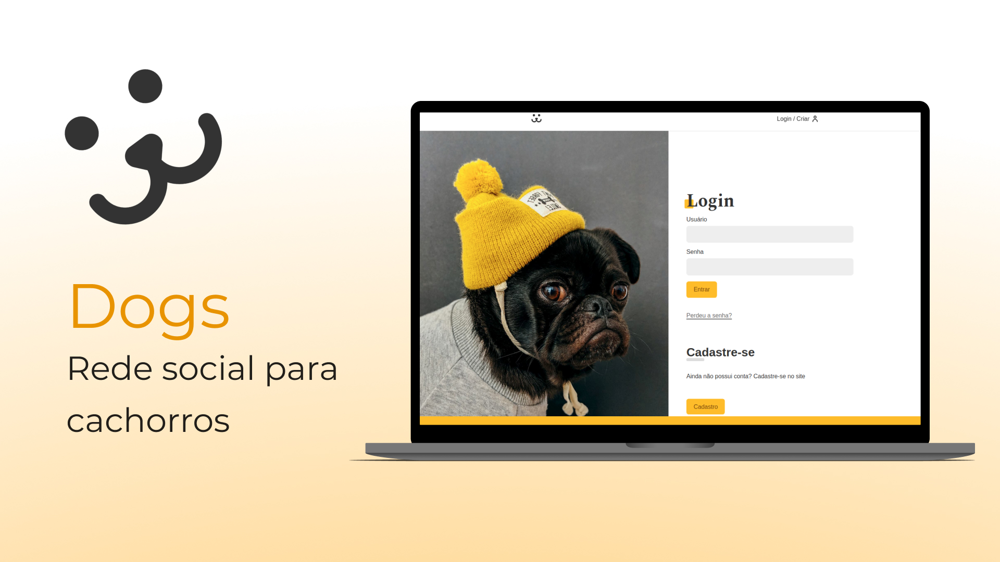

<div align="center" id="top"> 
  

  &#xa0;

  <!-- <a href="https://dogs.netlify.com">Demo</a> -->
</div>

<h1 align="center">Dogs</h1>

<p align="center">
  

  

  

  

</p>


<p align="center">
  <a href="#dart-sobre">Sobre</a> &#xa0; | &#xa0; 
  <a href="#sparkles-funcionalidades">Funcionalidades</a> &#xa0; | &#xa0;
  <a href="#rocket-tecnologias">Tecnologias</a> &#xa0; | &#xa0;
  <a href="#white_check_mark-pré-requesitos">Pré requisitos</a> &#xa0; | &#xa0;
  <a href="#checkered_flag-começando">Começando</a> &#xa0; | &#xa0;
  <a href="#memo-licença">Licença</a> &#xa0; | &#xa0;
  <a href="https://github.com/weescoelho" target="_blank">Autor</a>
</p>

<br>

## :dart: Sobre ##

Dogs é uma rede social para cachorros construída com React.js
A construção deste web app é um marco para mim, pois foi onde aprendi os principais conceitos de React.

Foi consumido uma API WordPress para criação de conta, autenticação, postagem de fotos, comentários e muito mais!

## :sparkles: Funcionalidades ##

:heavy_check_mark: Cadastrar uma nova conta;\
:heavy_check_mark: Postagem de fotos;\
:heavy_check_mark: Feed de fotos;\
:heavy_check_mark: Comentários;\
:heavy_check_mark: Relatório de acessos;

## :rocket: Tecnologias ##

As seguintes ferramentas foram usadas na construção do projeto:

- [React](https://pt-br.reactjs.org/)

## :white_check_mark: Pré requisitos ##

Antes de começar :checkered_flag:, você precisa ter o [Git](https://git-scm.com) e o [Node](https://nodejs.org/en/) instalados em sua maquina.

## :checkered_flag: Começando ##

```bash
# Clone este repositório
$ git clone https://github.com/weescoelho/dogs

# Entre na pasta
$ cd dogs

# Instale as dependências
$ yarn

# Para iniciar o projeto
$ yarn start

# O app vai inicializar em <http://localhost:3000>
```

## :memo: Licença ##


Feito com :heart: por <a href="https://github.com/weescoelho" target="_blank">Weslley Coelho</a>

&#xa0;

<a href="#top">Voltar para o topo</a>
